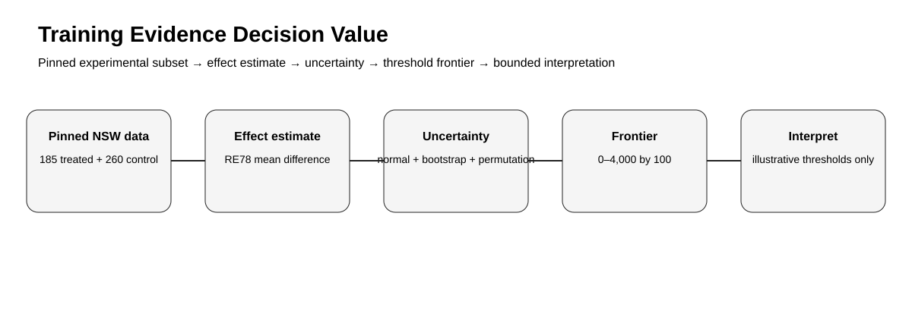
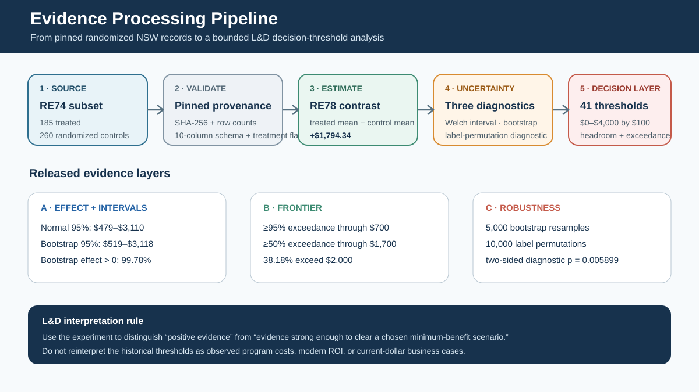
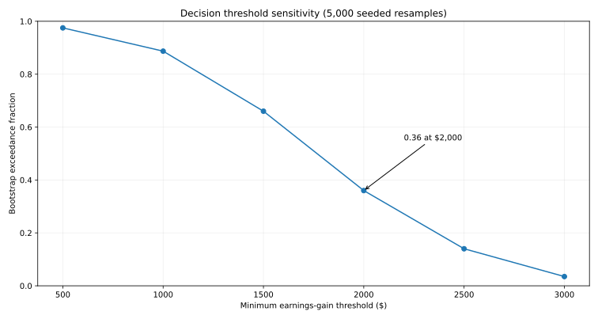
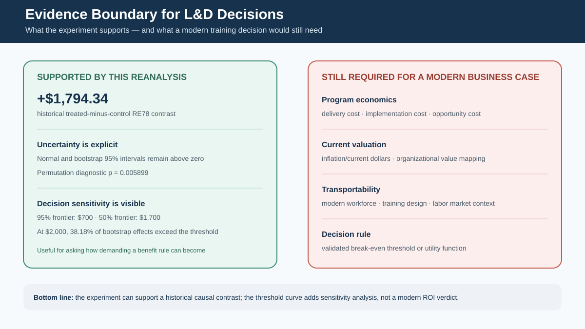

# Decision Value of Training Evidence: Reanalysis of the National Supported Work Experiment

> **Empirical Research Bundle** · **Portfolio Track: Learning & Development Research** · Training Evaluation / Decision Analysis / Evidence-Based L&D

Secondary reanalysis of the randomized National Supported Work experiment linking treatment-effect uncertainty to minimum-gain decision thresholds.



## Study status

**Completed secondary empirical analysis.** Reported findings were calculated from the named public source on 25 September 2026. The rebuild script contains **no synthetic fallback**. Raw source data are not republished unless source terms permit it; `data/source_manifest.json` records provenance, retrieval details, licensing notes, and the claim boundary.

## Research question

> How does the decision interpretation of randomized training evidence change as the minimum economically meaningful earnings gain changes?

## Design

- **Design:** Secondary analysis of the randomized National Supported Work experimental sample
- **Source:** National Supported Work Demonstration — Dehejia-Wahba experimental sample
- **Source page:** https://users.nber.org/~rdehejia/nswdata2.html
- **Direct data endpoint:** `https://www.nber.org/~rdehejia/data/nswre74_control.txt ; https://www.nber.org/~rdehejia/data/nswre74_treated.txt`
- **Retrieval / analysis date:** 2026-09-25
- **Licensing / reuse note:** NBER page permits attributable non-commercial use (CC BY-NC); this bundle stores derived statistics rather than raw participant records.

## Hypotheses

1. H1: the randomized treated group has higher mean 1978 earnings than the randomized control group in this sample.
2. H2: uncertainty around the mean difference is material relative to plausible implementation thresholds.
3. H3: bootstrap exceedance fractions fall as the minimum-gain threshold rises, so statistical evidence and decision sufficiency are not the same question.

## Empirical method

Compute the randomized treated-minus-control difference in 1978 earnings, a transparent large-sample normal interval, and a seeded 5,000-resample nonparametric bootstrap. For thresholds from $500 to $3,000, report the fraction of bootstrap resamples whose difference exceeds each threshold. Those fractions are resampling diagnostics, not posterior probabilities.



## Headline empirical finding

The observed randomized difference in 1978 earnings is $1,794.34. The seeded bootstrap 95% resampling interval is about $501–$3,097. The bootstrap exceedance fraction is 0.36 at a $2,000 threshold and falls to 0.035 at $3,000, illustrating the dependence of evidence interpretation on the decision threshold.

### Headline metrics

- **n control**: 260
- **n treated**: 185
- **control mean re78**: 4554.8
- **treated mean re78**: 6349.14
- **difference re78**: 1794.34
- **normal ci low**: 479.19
- **normal ci high**: 3109.5
- **bootstrap ci low**: 501.05
- **bootstrap ci high**: 3096.7
- **bootstrap positive exceedance fraction**: 0.997
- **bootstrap exceedance fraction gt 2000**: 0.36

The packaged derived tables are documented in `docs/data_dictionary.md`. That document states explicitly whether each CSV is a complete analysis table or a diagnostic subset.



## What this study can and cannot claim

**Can claim:** the computations in this repository summarize the named public dataset under the documented operationalization.

**Cannot claim:** This is a historical job-training experiment in a specific population and period. Randomization supports a causal effect for that experimental setting, but transport to modern corporate L&D requires separate justification. Bootstrap exceedance fractions are not Bayesian posterior probabilities.



## Reproduce

Offline verification of packaged empirical results:

```bash
python -m pip install -r requirements.txt
pytest -q
python run_demo.py
```

Recompute the empirical analysis from the public source (internet required):

```bash
python scripts/fetch_and_analyze.py
```

The online rebuild calls study-specific functions from `research/model.py`; the tests exercise those functions and scientific invariants rather than only checking file presence.

## Research bundle contents

- `README.md` — study overview and bounded findings
- `EMPIRICAL_STUDY.md` — protocol, validity, and interpretation
- `data/source_manifest.json` — provenance, license note, and claim boundary
- `data/derived/` — compact derived empirical tables
- `results/empirical_summary.json` — machine-readable headline results
- `scripts/fetch_and_analyze.py` — public-source rebuild
- `research/model.py` — reusable study-specific analysis functions
- `tests/` — behavioral and scientific-invariant tests
- `docs/` — analysis plan, data dictionary, paper blueprint, references, originality map
- `assets/` — four study-specific SVG figures

## Research integrity

This bundle distinguishes **source data**, **operationalization**, **result**, and **interpretation**. The analysis plan documents the released analysis; it is **not described as preregistered**. Public data do not automatically validate a construct, so proxy and external-validity limits are explicit.
